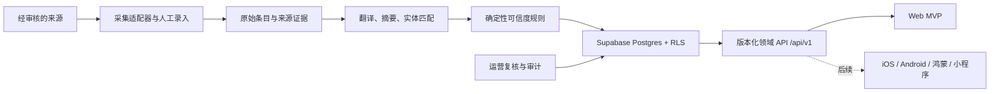

# 0126 Football M0 架构与范围评审

> 评审日期：2026-08-07 
> 对应计划：Day 5 
> 结论：**GO**，允许进入 M1 数据底座开发

## 1. 评审结论

MVP 继续以响应式 Web 为唯一交付客户端，同时冻结平台无关的数据库、认证、领域规则和未来 `/api/v1` 契约边界。iOS、Android、鸿蒙和微信小程序不进入本期功能范围，但可以复用稳定 UUID、Supabase Auth、RLS 和后续版本化 API。

本次评审确认没有把“来源身份已验证”误写成“自动采集已获授权”，也没有把 AI 定义为绝对真伪裁决者。

## 2. 冻结的 MVP 范围

### 本期 P0

- 用户可从 5 个联赛的 14 支球队中关注 1–5 支。
- 登录用户的关注可以跨会话保存；游客关注在登录后可合并。
- 按月历和手机日程查看所关注球队的信息。
- 每条信息显示来源、时间、原文链接、中文摘要和可解释的绿/蓝/红状态。
- 先接入经过准入审核的官方、RSS 或 API 来源；禁止绕过授权抓取。
- 具备来源管理、人工复核、审计和基础运行监控。

### 不进入本期

- 原生 iOS、Android、鸿蒙和微信小程序客户端。
- 评论、社区、积分、付费订阅、视频托管和全网搜索。
- 未获得展示/自动采集权的站点爬虫。
- 仅由模型置信度把非官方消息升级为绿色。

## 3. 目标架构与数据流

边界决定：

- 客户端不直接拥有可信度、关注上限、来源准入等唯一业务事实。
- 公共球队目录可以匿名只读；用户资料和关注由 RLS 隔离。
- 来源权利备注和采集开关是内部数据，不对客户端开放。
- 事件、新闻、采集运行和 AI 评估表按项目日历在 Day 16、21–22、31–40 实现，本周不提前扩表。

## 4. 成本边界

| 成本项 | MVP 控制方式 | 升级触发条件 |
|---|---|---|
| Supabase | 单项目、索引优先、目录静态缓存、RLS 查询可索引 | 数据量/并发接近套餐阈值并有监控证据 |
| Vercel | Web + 轻量 API；避免把长任务塞入请求链路 | 定时任务或 AI 超出函数时长/成本预算 |
| 来源 | RSS/API/书面授权优先；HTML 默认不启用 | 完成权利、频率、缓存和删除规则审核 |
| AI | 只处理新增且去重后的条目；记录模型、tokens 和重试 | 每千条成本与质量达到里程碑阈值 |
| 原生端 | 当前不投入开发成本 | Web MVP 闭环、API 稳定、商店合规与预算批准 |

成本预算在真实采集和 AI 供应商确定后补充金额；当前 M0 冻结的是成本控制机制，不虚构尚不存在的报价。

## 5. 非功能验收指标

- 生产采集成功率目标不低于 99%。
- 绿色误标必须为 0；任何非官方来源不能由 AI 单独升级为绿色。
- 用户只能读写自己的资料和关注；匿名用户不能读取任何用户关注。
- 每位登录用户最多 5 支球队，数据库层强制执行。
- migration、seed、RLS 和数据库测试纳入版本控制；生产先备份、后迁移、再验证。
- 新 P0 能力必须可由平台无关领域服务/API 表达。

## 6. M0 签字结果

| 评审项 | 结果 | 证据 |
|---|---|---|
| 产品范围 | 通过 | 项目计划、用户流程、需求追踪矩阵 |
| 来源准入 | 通过 | 来源登记表与 2026-08-06 审核报告 |
| 可信度规则 | 通过 | 可信度规范 v1 |
| 多端边界 | 通过 | 平台架构 v1 |
| 数据底座范围 | 通过 | Day 6–10 仅实现目录、来源、资料和关注 |
| 成本机制 | 通过 | 本文 §4；金额待供应商/真实流量 |

遗留风险不阻断 M1：生产数据库迁移需要先完成备份与 Preview 演练；真实来源采集继续受授权状态约束。

