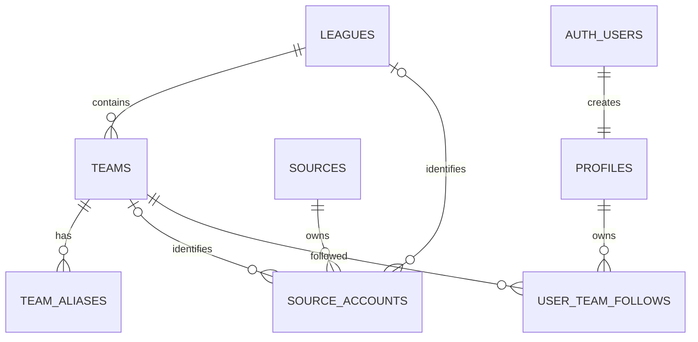

# 0126 Football M1 数据底座评审

> 覆盖：Day 6–10 
> 评审日期：2026-08-07 
> 结论：**仓库与本地数据库验收 GO；生产发布 NO-GO**

## 1. 每日交付结果

| Day | 计划 | 已交付 | 仓库状态 |
|---:|---|---|---|
| 6 | 联赛、球队、别名 | `leagues`、`teams`、`team_aliases`，UUID、外键、搜索/外键索引、匿名只读 RLS | 完成 |
| 7 | 来源与账号 | `sources`、`source_accounts`，准入状态、权利备注、身份验证与采集开关，客户端默认无权限 | 完成 |
| 8 | 用户资料与关注 | `profiles`、`user_team_follows`、Auth trigger、本人 CRUD RLS、列级 update grant、最多 5 队约束 | 完成 |
| 9 | 初始数据 | 5 联赛、14 球队、62 别名、19 官方来源身份、19 官网账号；seed 幂等 upsert | 完成 |
| 10 | 约束、权限、备份与演练 | 连续 2 次 reset、幂等 seed、43 项 pgTAP（含双用户 RLS）、数据库 lint、迁移/备份/回滚手册 | 本地完成；生产备份与迁移待授权放行 |

## 2. 数据关系

未来客户端只依赖稳定 UUID 与领域语义，不依赖 React 状态、DOM 或 Local Storage。新闻/事件关系在 Day 16 建模，不在本轮提前实现。

## 3. 安全与约束复核

- 7 张新增 `public` 表全部启用 RLS。
- 目录表仅开放 SELECT；来源内部表无 anon/authenticated 权限与策略。
- profile 由 `auth.users` trigger 创建；函数位于非公开 schema、使用空 `search_path`，客户端无 execute 权限。
- profile 只开放本人 SELECT，以及 `display_name`、`locale`、`timezone` 三列 UPDATE。
- follows 的 SELECT/INSERT/UPDATE/DELETE 均要求 `auth.uid() = user_id`。
- `sort_order` 只能是 0–4 且用户内唯一，从数据库层限制最多 5 支球队。
- 来源只有在 `approved_feed`/`approved_api` 状态时才允许 `collection_enabled = true`。
- 外键查询列和别名查询列均建立索引。

## 4. 种子数据复核

| 数据 | 数量 | 说明 |
|---|---:|---|
| 联赛 | 5 | 英超、西甲、德甲、意甲、法甲 |
| 球队 | 14 | 英超 6 队，其余联赛各 2 队 |
| 球队别名 | 62 | 中文、英文及必要的德/意/法文常用名 |
| 官方来源身份 | 19 | 5 联赛 + 14 俱乐部官网 |
| 官网账号 | 19 | 仅网站身份；未伪造 YouTube/X 稳定账号 ID |
| 自动采集启用 | 0 | 授权审核前全部关闭 |

## 5. 与需求目标对齐

| 需求 | 本轮贡献 | 仍待后续 |
|---|---|---|
| PM-01 | 14 队和 5 联赛形成可查询数据事实 | 无 |
| ARCH-01 | 稳定 UUID、UTC 时间、平台无关表结构 | `/api/v1` 在后续前后端阶段实现 |
| DB-01 | 球队、来源、资料、关注底座完成 | 新闻/事件簇 Day 16，采集/AI/审计后续实现 |
| AUTH-01 | Auth 关联、profile 与关注 RLS 完成 | 登录 UI、游客合并与跨设备 E2E 在 Day 14–15 |
| TRUST-01 | 官方域名白名单结构化；身份与采集权分离 | 社交平台稳定 ID 与实际 feed/API 授权 |
| PM-02 | rights/status/collection 强约束落库 | 每个来源持续复核与删除流程运营化 |

结论：项目没有偏离“选队 → 日历 → 可追溯信息 → 可解释可信度”的主目标。本轮只完成其安全数据底座，未把后续 UI、采集或 AI 错报为完成。

## 6. 放行条件

仓库与本地数据库验收已通过。生产数据库发布前仍必须补齐：

1. 使用管理 access token 登录并核对远程 migration 历史与 schema 漂移。
2. Supabase 平台备份/PITR 状态证据与逻辑备份恢复演练。
3. `db push --dry-run` 审核无误后，再由负责人批准生产迁移。

