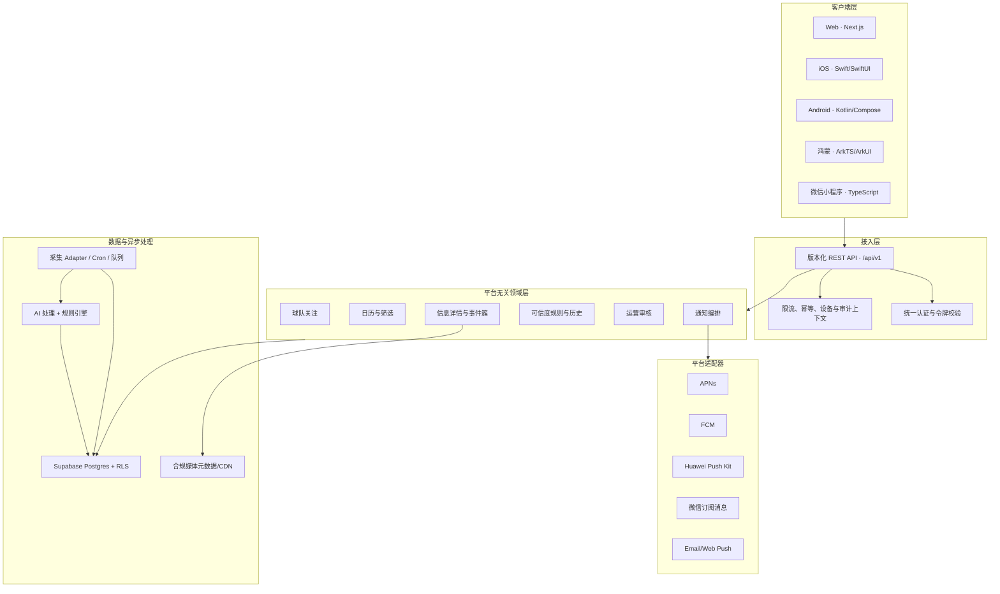

# 0126 Football 多端可扩展平台架构

> 版本：v1.0<br>
> 更新日期：2026-08-06<br>
> 架构原则：Web 优先交付，后台与数据契约从第一天支持未来 iOS、Android、鸿蒙和微信小程序

## 1. 范围决策

当前 45 个工作日 MVP 只开发响应式 Web。iOS、Android、鸿蒙和微信小程序不进入当前交付范围，但任何 P0 后端设计不得依赖 Next.js 页面内部状态或浏览器专属能力。

满足以下条件后再启动原生端：

- Web MVP 的球队关注、日历、详情和可信度闭环通过验证。
- `/api/v1` 核心契约稳定，并具备兼容策略和自动契约测试。
- 真实来源授权、内容展示权和各应用商店/小程序平台政策已确认。
- 已明确各端负责人、预算、发布账号、隐私合规和通知方案。

## 2. 目标架构



## 3. 架构原则

### 3.1 API 优先，不以页面作为后台

- 所有跨端核心能力通过版本化 JSON API 提供。
- Next.js Server Components 可以调用同一领域服务，但不能成为唯一业务入口。
- 页面路由、React 状态和浏览器 Local Storage 不得承载唯一业务事实。
- 初期保持模块化单体，不为“未来可能”提前拆微服务；模块边界稳定后再按负载拆分。

### 3.2 平台无关领域模型

- 球队、来源、信息条目、事件簇、可信度、关注和审核记录使用稳定 UUID。
- 时间统一存 UTC，API 返回 ISO 8601，并显式提供事件时区。
- 可信度返回状态码、理由码和结构化证据，不返回依赖某端 UI 的 HTML。
- 内容正文以安全纯文本/受控结构化块为主，客户端决定原生渲染。
- 枚举只追加不复用；客户端必须容忍未知枚举值。

### 3.3 契约与兼容

- 使用 OpenAPI 描述 `/api/v1`，并用 JSON Schema 校验请求和响应。
- 采用游标分页、稳定排序和增量同步游标，支持移动端弱网与离线缓存。
- 破坏性修改进入 `/api/v2`；`v1` 至少保留一个已发布客户端升级周期。
- 每个响应包含 `schema_version`；错误使用稳定 `error_code`，不让客户端解析错误文案。
- iOS、Android、鸿蒙和小程序可由契约生成类型，但不强制共享 UI 代码。

## 4. API 能力边界

| 能力 | 建议端点 | 跨端要求 |
|---|---|---|
| 联赛与球队目录 | `GET /api/v1/teams` | 多语言名称、别名、Logo URL、增量版本 |
| 我的关注 | `GET/PUT /api/v1/me/follows` | 幂等、排序、最多 5 队、游客合并令牌 |
| 情报日历 | `GET /api/v1/calendar` | 日期、时区、球队、类型、可信度筛选和游标 |
| 信息详情 | `GET /api/v1/news/{id}` | 摘要、原文、来源、理由、事件簇和历史 |
| 可信度说明 | `GET /api/v1/trust/rules` | 状态文案、颜色 token、图标语义和规则版本 |
| 登录会话 | `/api/v1/auth/*` 或认证适配器 | 支持 Web Cookie 和移动端 Bearer Token |
| 设备注册 | `POST /api/v1/me/devices` | 平台、推送 token、语言、时区和撤销 |
| 增量同步 | `GET /api/v1/sync?cursor=` | 可重放、幂等、删除 tombstone |
| 运营审核 | `/api/v1/admin/*` | RBAC、双人复核、完整审计 |

端点名称是目标契约，具体实现要在 Day 5 架构评审后冻结。

## 5. 认证与账号合并

- Supabase Auth 作为初期身份底座，服务端验证 JWT 和用户状态。
- Web 使用安全 Cookie/SSR 会话；原生端使用系统安全存储保存短期令牌和刷新凭据。
- 游客关注使用随机 `guest_id` 与签名合并令牌，登录时调用幂等合并接口。
- Apple、Google、手机号、微信登录和华为账号作为认证 Provider 适配器，不进入核心用户表结构。
- `profiles` 只保存业务资料；第三方账号映射单独存储，避免供应商锁定。
- 管理员权限只由服务端角色和审计规则决定，客户端隐藏按钮不能代替授权。

## 6. 数据同步与离线体验

- 客户端本地缓存球队目录、关注列表、近期日历和已打开详情。
- API 使用 `updated_at + stable_id` 或服务器签发的同步游标提供增量变更。
- 删除通过 tombstone 同步，避免离线端永久保留已撤回内容。
- 关注修改使用幂等键和乐观并发版本，冲突时返回可合并结果。
- 离线状态允许浏览已缓存内容，但明确显示“最后更新时间”。
- 可信度状态与撤回通知优先于普通内容刷新。

## 7. 通知适配

核心领域只产生平台无关事件，例如：

```text
OFFICIAL_NEWS_PUBLISHED
TRUST_STATUS_CHANGED
DAILY_DIGEST_READY
SOURCE_ITEM_REMOVED
```

通知编排层根据用户偏好、时区、静默时段和平台映射到 APNs、FCM、Huawei Push Kit、微信订阅消息、Web Push 或邮件。消息模板保存语义字段和深链目标，不在领域逻辑中写死平台格式。

## 8. 客户端实现策略

| 客户端 | 建议技术 | 当前阶段 | 关键适配点 |
|---|---|---|---|
| Web | Next.js + TypeScript | 当前 MVP | SSR、SEO、响应式、游客体验 |
| iOS | Swift + SwiftUI | 后续 | Sign in with Apple、APNs、Universal Links、Keychain |
| Android | Kotlin + Jetpack Compose | 后续 | Google/手机号登录、FCM、App Links、Keystore |
| 鸿蒙 | ArkTS + ArkUI | 后续 | 华为账号、Push Kit、App Linking、安全存储 |
| 微信小程序 | TypeScript + 原生小程序框架 | 后续 | 微信登录、订阅消息、合法域名、内容和外链政策 |

不建议为了复用页面而强制所有端采用同一跨平台 UI 框架。优先共享 API 契约、状态语义、设计 token、图标资产和测试样例；各端保持符合平台习惯的原生体验。

## 9. 设计系统与可访问性

- 建立平台无关设计 token：颜色、字号、间距、圆角、阴影和动效语义。
- 可信度 token 使用 `trust.confirmed/unverified/rumor`，各端映射本地颜色资源。
- 标签同时提供文字和图标，不能仅依赖颜色。
- 中文、英文和后续语言文案使用稳定 key，不把中文文案当作逻辑判断值。
- 交互目标、动态字体、屏幕阅读器和减少动态效果在各端分别验收。

## 10. 安全、隐私与平台合规

- Publishable key 可以出现在客户端；service role、AI 和采集凭据只能保存在服务端。
- RLS 作为数据库最后防线，API 仍执行对象级授权、速率限制和输入校验。
- 设备 token、第三方身份和通知偏好按最小化原则保存并支持注销删除。
- 外部来源条款必须覆盖对应终端展示；Web 获得的授权不能自动推定适用于 App 或小程序。
- 各应用商店、鸿蒙和微信小程序的隐私清单、账号注销、内容审核与外链政策在立项时重新核对。

## 11. 仓库与模块边界建议

当前无需立即迁移 monorepo，但代码应逐步形成以下逻辑边界：

```text
apps/web                 # 当前 Next.js Web
packages/contracts       # OpenAPI、JSON Schema、枚举和错误码
packages/domain          # 平台无关业务规则，不引用 React/浏览器 API
packages/design-tokens   # 颜色、排版和图标语义
server/adapters          # Supabase、来源、AI、通知供应商适配
```

当第一个非 Web 客户端正式立项时再迁移实际目录，避免当前重构只产生形式成本。数据库 migration 和契约文件从现在开始保持平台无关。

## 12. 架构验收护栏

每个 P0 功能合并前检查：

- 业务规则是否能在没有 React/DOM/Local Storage 的环境执行。
- 客户端所需数据是否存在版本化 API 或明确的安全直连契约。
- API 是否支持游标分页、时区、未知枚举和稳定错误码。
- 是否避免返回未经清洗 HTML、服务端密钥或数据库内部字段。
- 新通知是否使用平台无关事件，再由适配器投递。
- 变更是否同步更新 OpenAPI、需求矩阵和契约测试。

## 13. 当前结论

多端扩展属于明确的架构约束，不属于当前 MVP 的功能范围。Web 继续作为验证产品价值的第一客户端；所有新 P0 数据模型和业务服务必须满足未来 iOS、Android、鸿蒙和微信小程序复用后台能力的要求。
