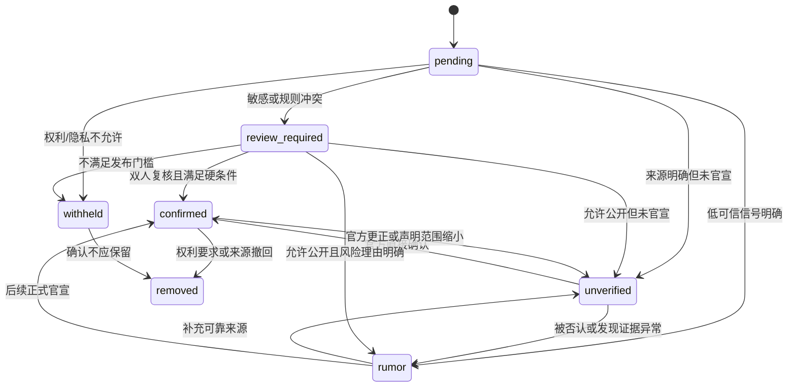

# 0126 Football 可信度标注规范

> 版本：v1.0<br>
> 冻结日期：2026-08-06<br>
> 对应计划：Day 4——绿/蓝/红规则、敏感内容、人工覆盖与示例判定

## 1. 目标与边界

本规范用于判断“当前证据对某项具体声明的支持程度”，不判断世界上的绝对真伪。评估对象是结构化声明或事件簇，不是整篇文章，也不是对一个来源作永久评价。

必须遵守：

- AI 无权单独把内容升级为绿色。
- 来源等级只是证据信号，不能代替对具体声明的判断。
- 同一文章中的不同声明可以有不同状态。
- 用户界面必须同时显示颜色、文字、图标、判定理由和更新时间。
- 敏感内容可以不公开；“不公开”不等于红色。

## 2. 状态模型

### 2.1 用户可见状态

| 状态 | UI | 含义 | 硬条件 |
|---|---|---|---|
| `confirmed` | 绿色 · ✓ 官方确认 | 已验证官方主体直接确认该项具体事实或安排 | 官方来源验证通过、原文可访问、声明与主体直接相关 |
| `unverified` | 蓝色 · ? 待核实 | 来源明确且具备一定可信基础，但尚无官方直接确认 | 至少一个已识别来源；不存在明确伪造证据；不满足绿色硬条件 |
| `rumor` | 红色 · ! 传闻/低可信 | 来源链不清、证据异常、内容被可靠来源否认或已明显失效 | 至少一个可展示的风险原因；敏感内容先经过人工审核 |

### 2.2 内部流程状态

| 状态 | 是否公开 | 用途 |
|---|---|---|
| `pending` | 否 | 尚未完成规范化、来源识别或证据评估 |
| `review_required` | 否 | 敏感、高影响、模型不确定或规则冲突，等待人工复核 |
| `withheld` | 否 | 因隐私、未成年人、安全、诽谤风险或权利要求暂不展示 |
| `removed` | 否，仅保留审计记录 | 原文删除、权利方要求、内容违法或运营撤回 |

内部状态不能用红色替代。未经证实的犯罪指控、私人医疗细节等内容应进入 `review_required/withheld`，不能为了满足“三色展示”而直接公开。

## 3. 绿色规则

只有全部满足以下条件才可标绿：

1. 来源命中已人工验证的官方白名单，且域名或平台稳定账号 ID 匹配。
2. 原文仍可访问，发布时间和来源主体可确认。
3. 该主体有权直接确认该事项，例如俱乐部确认本队签约，联赛确认赛程变更。
4. 具体声明来自正式公告、直接发布或可追溯的完整原话。
5. 内容未被识别为媒体转载、传闻汇总、赞助软文、观点或玩笑。

绿色表示“官方主体确实作出该项声明”，不保证该声明永远不会被更正。

下列内容不得仅因位于官方域名而标绿：

- `Media Watch`、转会传闻汇总和外部媒体转载。
- 俱乐部作者的评论、预测或战术观点。
- 球迷投票、赞助内容、广告和娱乐性内容。
- 球员谈论他人转会的个人猜测。
- 官方账号遭冒充、被盗或发布异常时的内容。

## 4. 蓝色规则

满足以下任一情况且没有红色硬风险时标蓝：

- 主流媒体或已审核记者报道，但没有官方直接确认。
- 经纪人、球员、教练或管理人员表达谈判、意向或主观看法，但尚未形成官方事实。
- 两个以上独立可靠来源相互佐证，但官方尚未发布。
- 官方站点引用外部媒体、使用模糊措辞或只确认事件的一部分。
- 原始来源身份明确，但证据尚不足以升级为绿色。

多个转载同一个通讯社、记者或匿名信源只算一个证据源。蓝色可以附带内部证据等级，例如 `single_source`、`multi_source`、`direct_quote`，但用户主标签保持蓝色。

## 5. 红色规则

出现以下信号之一，经发布门槛检查后可标红：

- 匿名爆料、无原始链接、无法识别首发来源。
- 伪造或高度可疑的截图、域名、账号、时间线或引用。
- 多层转载后无法还原原始声明。
- 内容已被官方或可靠证据明确否认。
- 旧闻被改日期、换标题或脱离上下文重新传播。
- 来源长期存在严重错误、删除记录或冒充行为。
- 标题所称事实在正文或原文中不存在。

红色必须展示具体原因，例如“未找到原始来源”“官方已否认”“截图账号不是官方账号”，禁止仅显示“AI 认为不可信”。

## 6. 判定优先级

规则按以下顺序执行：

1. 权利、隐私与安全检查：决定是否允许处理和展示。
2. 敏感内容检查：决定是否必须人工复核。
3. 来源身份验证：官方、媒体、记者、社区或未知。
4. 声明直接性：第一手、采访、引用、转载或匿名转述。
5. 官方确认/否认硬规则。
6. 独立佐证、时间一致性和冲突检测。
7. AI 提取的辅助信号和内部 `confidence_score`。
8. 展示状态与用户可读理由生成。

硬规则优先于分数。`confidence_score` 再高也不能把非官方报道变为绿色；分数再低也不能自动公开高风险敏感传闻。

## 7. 敏感内容规则

| 类别 | 默认处理 | 可公开条件 | 禁止项 |
|---|---|---|---|
| 伤病与医疗 | 蓝色或人工复核 | 官方公告、本人公开声明，或主流媒体仅描述比赛可用性 | 私人病历、未经同意的诊断、住址和联系方式 |
| 纪律、犯罪与诉讼 | `review_required` | 官方机构公开文件或至少一家具名主流媒体审慎报道，并使用“被指控/调查中”表述 | 把指控写成定罪；公开受害人或无关家属隐私 |
| 未成年人 | `review_required` | 官方青训/比赛公开信息且与公共体育活动直接相关 | 私人学校、地址、联系方式、非公开家庭信息 |
| 死亡、失踪和人身安全 | `review_required` | 官方主体或家属授权声明；必要时两个可靠独立来源 | 抢先发布未经确认身份、现场血腥细节或定位信息 |
| 性侵、骚扰和歧视指控 | `withheld` 优先 | 法律/官方公开信息并经人工双人复核 | 匿名单一来源直接公开、受害人身份推断 |
| 赌博、操纵比赛和财务犯罪 | `review_required` | 监管、司法或赛事机构文件；主流媒体具名调查 | 将调查等同于结论 |
| 球员私人关系 | 默认不收录 | 当事人主动公开且与职业赛事有明确关联 | 猜测性恋情、家庭冲突、未公开身份信息 |

所有敏感内容必须记录 `sensitivity_type`、复核人、发布依据和复核时间。高影响绿色/红色条目要求双人复核。

## 8. 人工覆盖流程

### 8.1 权限

- `reviewer`：可提出修改、补充证据、隐藏条目。
- `senior_reviewer`：可批准绿色、红色和敏感内容发布。
- `admin`：管理来源白名单和撤销错误操作，不能删除审计历史。

### 8.2 必填信息

每次人工覆盖必须保存：

- 原状态、新状态和内部流程状态。
- 标准理由码与用户可读说明。
- 至少一个证据 URL；无法提供时只能隐藏或保持待复核。
- 操作人、批准人、时间和可选到期时间。
- 所依据的规则版本、模型版本和来源白名单版本。

### 8.3 约束

- 人工不能绕过来源权利状态；禁用来源仍不得自动采集或送入 AI。
- 标绿仍必须满足官方来源硬条件。
- 敏感内容从隐藏改为公开需要第二名复核者批准。
- 覆盖可撤销，但历史不可修改或物理删除。
- 原文删除或官方更正触发重新评估；不能保留过时绿色状态。

## 9. 状态流转



## 10. 用户可读理由模板

| 理由码 | 用户文案示例 |
|---|---|
| `OFFICIAL_DIRECT` | 该消息来自俱乐部官方公告，并直接确认了此事项。 |
| `OFFICIAL_LIMITED_SCOPE` | 官方只确认了部分信息，其余细节仍待核实。 |
| `REPUTABLE_SINGLE_SOURCE` | 该消息来自一家已审核媒体，目前尚无官方确认。 |
| `INDEPENDENT_MULTI_SOURCE` | 多个独立可靠来源报道了相同进展，但尚未官宣。 |
| `SECONDARY_REPOST` | 多家报道追溯到同一个原始来源，不能视为独立佐证。 |
| `NO_PRIMARY_SOURCE` | 暂未找到可核验的原始发布或完整原文。 |
| `OFFICIAL_DENIAL` | 相关主体已公开否认这项说法。 |
| `SUSPECTED_FABRICATION` | 截图、账号或引用存在无法解释的不一致。 |
| `OUTDATED_CONTEXT` | 这是旧信息或已失效内容，被重新包装传播。 |
| `HUMAN_OVERRIDE` | 运营复核后根据新增证据调整了状态。 |

## 11. 20 条示例判定

| # | 场景 | 结果 | 主要理由 |
|---:|---|---|---|
| 1 | 俱乐部官网发布新援签约公告 | 绿色 | 已验证官方来源直接确认本队签约 |
| 2 | 联赛官网公布某场比赛改期 | 绿色 | 联赛有权确认自身赛程安排 |
| 3 | 俱乐部正式公告球员将缺席两周 | 绿色 | 官方直接确认范围明确的伤病/可用性信息 |
| 4 | 俱乐部发布会页面提供主教练完整原话 | 绿色 | 可追溯的第一手官方记录 |
| 5 | 已验证球员账号宣布自己离队 | 绿色 | 当事人直接确认自己的决定；仍需验证稳定账号 ID |
| 6 | Liverpool 官网 `Media Watch` 转述报纸转会传闻 | 蓝色 | 官方域名中的外部媒体转载，不是俱乐部确认 |
| 7 | BBC 报道两家俱乐部正在谈判 | 蓝色 | 可靠媒体单一来源，尚无官宣 |
| 8 | 两家网站都引用同一名记者称“已达协议” | 蓝色 | 只有一个原始来源，不算独立双重证实 |
| 9 | 两家独立主流媒体分别确认体检安排 | 蓝色 | 多源佐证提高证据，但仍无官方直接确认 |
| 10 | 已审核跟队记者称报价已经提交 | 蓝色 | 来源明确但不是有权官宣的主体 |
| 11 | 经纪人接受具名采访称双方正在谈判 | 蓝色 | 第一手谈话只确认谈判，不确认最终签约 |
| 12 | 俱乐部只确认球员获准缺席训练，媒体称即将转会 | 蓝色 | 官方只确认缺训，不能扩展为转会确认 |
| 13 | 匿名聚合账号称“Here we go”但没有原文 | 红色 | 无法识别首发来源，疑似冒充表达 |
| 14 | 截图显示假冒俱乐部账号发布官宣 | 红色 | 账号 ID/域名不匹配官方白名单 |
| 15 | 三十家网站转载同一个匿名论坛帖子 | 红色 | 转发数量不是独立证据，原始来源低可信 |
| 16 | 俱乐部公开否认某项转会报道 | 原传闻红色；否认声明绿色 | 对两个不同声明分别评估并保留时间线 |
| 17 | 两年前的伤病新闻改成当天日期重新传播 | 红色 | 时间和上下文失效 |
| 18 | 标题称“球员已签约”，正文只说“可能报价” | 红色 | 标题事实在原文中不存在 |
| 19 | 匿名账号声称球员患有未公开疾病 | 暂不展示 | 私密医疗传闻进入人工复核，不直接公开为红色 |
| 20 | 单一匿名信源指控球员犯罪 | 暂不展示 | 诽谤与安全风险高，必须等待官方文件或审慎具名报道 |

## 12. AI 输出与验收

AI 只能输出结构化建议：

```text
suggested_status
confidence_score
claim_scope
source_identity_signal
directness_signal
corroboration_count
conflict_signal
sensitivity_types[]
reason_codes[]
evidence_urls[]
requires_human_review
```

最终状态由规则引擎执行硬条件后生成。验收指标：

- 绿色 precision = 100%。
- 红色和敏感内容发布前人工复核覆盖率 = 100%。
- 每条公开状态至少一个用户可读理由和一个可追溯证据。
- 状态变化审计记录完整率 = 100%。
- 300 条人工基准集上总体标签一致率至少 85%。

## 13. Day 4 验收结论

绿/蓝/红硬规则、内部状态、敏感内容门槛、人工覆盖权限与审计字段、状态流转、理由模板和 20 条示例已经冻结。此处完成的是产品与规则规格；规则引擎、AI 评估和运营后台仍按 Day 35–40 实施。
