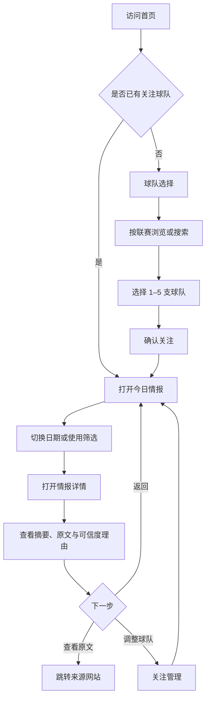
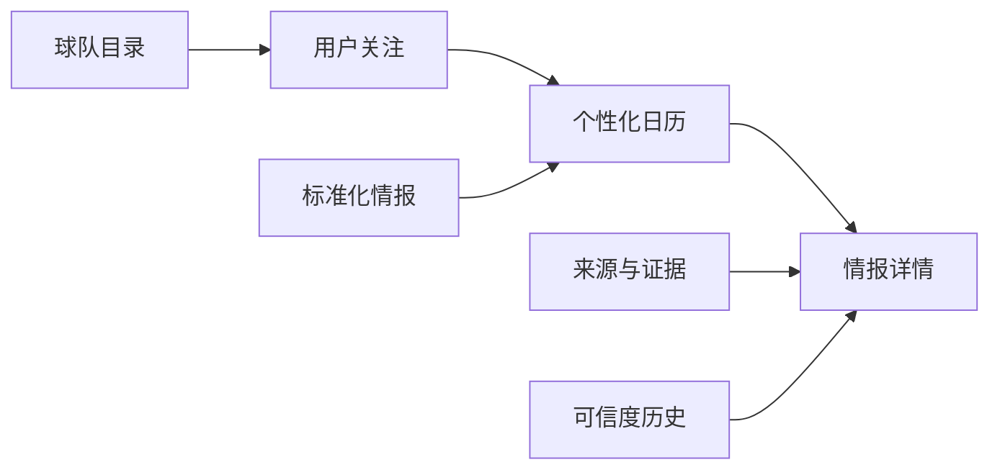

# 0126 Football 用户流程与页面信息架构

> 版本：v1.1 
> 日期：2026-08-06 
> 对应计划：Day 2——球队选择、日历、信息详情、可信度解释

## 1. 文档目标

本文件冻结 MVP 的核心用户流程和页面边界，使产品、设计、前端、后端和测试对“用户如何选队、如何按日期获取信息、如何理解可信度”形成一致认识。

首期体验目标：新用户在 60 秒内选择 1–5 支球队，并在专属日历中看到可追溯到原始来源的中文球队情报。

## 2. 核心用户与首要任务

### 2.1 主要用户

- 中国球迷，希望集中查看喜欢球队的官方动态、新闻和可靠转会信息。
- 时间有限的用户，希望通过日期、球队和可信度快速筛选，而不是浏览多个平台。
- 对传闻敏感的用户，希望知道信息为何被标为官方确认、待核实或低可信。

### 2.2 核心任务

1. 找到并关注喜欢的球队。
2. 打开今天或指定日期的球队情报。
3. 按球队、信息类型和可信度筛选。
4. 查看中文摘要、原始来源和可信度依据。
5. 修改关注球队，并在后续访问中保留选择。

## 3. 核心流程总览

## 4. 详细用户流程

### 4.1 首次访问与球队选择

1. 用户进入首页。
2. 系统未发现本地或账号关注记录，展示产品价值和“选择我的球队”主按钮。
3. 用户进入球队选择页，默认按联赛分组展示 14 支球队。
4. 用户可以输入中文名、英文名或常用简称搜索。
5. 用户选择 1–5 支球队；页面持续显示已选数量和上限。
6. 用户确认后，游客选择保存到本地；登录用户保存到账号。
7. 系统进入“今天”日程，并仅展示所关注球队的内容。

异常与边界：

- 未选择球队时，确认按钮不可用并说明至少选择 1 支。
- 达到 5 支后，其他球队保持可见但不可继续选择，并提示上限。
- 保存失败时保留当前选择，提供重试，不让用户重新选择。
- 搜索无结果时显示清空搜索和按联赛浏览入口。

### 4.2 日历浏览与筛选

1. 默认打开今天的移动日程列表。
2. 顶部显示日期导航、“回到今天”和月历入口。
3. 每条信息显示球队、发布时间、信息类型、可信度文字/图标/颜色、标题和摘要。
4. 用户可组合筛选球队、信息类型、可信度和来源类型。
5. 用户切换日期或月份后，筛选条件保留在 URL 中。
6. 某日无结果时，系统说明是“暂无情报”还是“筛选后无结果”，并提供相应操作。

### 4.3 情报详情与原文追溯

1. 用户点击日历条目进入详情页。
2. 首屏展示标题、球队、发布时间、来源、可信度状态和中文摘要。
3. “为什么这样标记”区域展示判定依据，例如官方域名、多个独立来源、单一记者消息或低可靠来源。
4. 用户可打开原文；外部链接明确标识来源站点并在新窗口打开。
5. 若标签曾变化，展示状态历史和更新时间。
6. 用户返回时恢复原日期、筛选条件和滚动位置。

### 4.4 可信度解释

标签必须同时使用颜色、文字和图标，不能只依靠颜色：

| 状态 | UI 文案 | 颜色 | 含义 | 示例依据 |
|---|---|---|---|---|
| `confirmed` | 官方确认 | 绿色 | 该具体事实由球队、联赛或赛事官方直接发布 | 球队官网公告、官方注册结果 |
| `unverified` | 待核实 | 蓝色 | 来自可信媒体/记者，但尚无直接官方确认 | 多家主流媒体独立报道 |
| `rumor` | 传闻/低可信 | 红色 | 证据不足、来源链不清或历史可靠度较低 | 匿名转载、单一低可信账号 |

产品约束：

- AI 标签是基于来源和证据的辅助判断，不宣称对事实作最终裁决。
- 每个标签至少展示一条人能理解的判定理由。
- 官方渠道只有对其直接确认的具体事实才自动为绿色。
- 状态可以随新证据变化，并保留历史。
- 运营人员可人工覆盖，但必须填写理由。

## 5. 页面信息架构

| 页面 | 路由建议 | 核心内容 | 主要操作 | MVP 优先级 |
|---|---|---|---|---|
| 产品入口/今日情报 | `/` | 今日摘要、已关注球队情报、首次使用引导 | 选队、打开详情、进入日历 | P0 |
| 球队选择 | `/onboarding/teams` | 联赛分组、搜索、球队卡片、已选栏 | 选择 1–5 队、确认 | P0 |
| 情报日历 | `/calendar` | 日期导航、日程/月历、筛选器、信息条目 | 换日期、筛选、打开详情 | P0 |
| 情报详情 | `/news/[id]` | 中文摘要、原文、来源、标签理由、状态历史 | 打开原文、返回日历 | P0 |
| 关注管理 | `/settings/teams` | 当前关注、球队目录 | 新增、移除、排序 | P0 |
| 登录/注册 | `/auth` | 登录、注册、游客数据说明 | 登录并合并游客关注 | P0 |
| 可信度说明 | `/about/trust` | 标签定义、证据规则、免责声明 | 理解规则 | P0 |
| 运营后台 | `/admin` | 来源、条目、标签、人工覆盖 | 审核与纠错 | P0 |

### 5.1 全局导航

- 移动端底部导航：今日、日历、球队、我的。
- 桌面端顶部导航：今日情报、日历、关注球队、可信度说明。
- 全局右上角：登录状态或游客标识。

### 5.2 关键页面状态

所有 P0 页面必须定义：

- 加载状态：保留页面骨架，避免布局跳动。
- 空状态：说明为什么为空，并给出下一步。
- 错误状态：显示可重试操作和简短错误说明。
- 离线/网络异常：保留已加载内容并提示数据可能不是最新。
- 权限状态：登录内容不可泄露给其他用户。

## 6. 核心用户故事与验收标准

### US-01 选择球队

作为首次访问的球迷，我希望按联赛或搜索选择 1–5 支球队，以便看到专属内容。

验收标准：

- 14 支球队均可按联赛浏览。
- 中文、英文和常用简称均能搜索。
- 少于 1 支不能提交，超过 5 支不能继续选择。
- 手机端正常流程可在 60 秒内完成。

### US-02 保留关注

作为游客，我希望刷新页面后仍保留关注球队，以免重复选择。

验收标准：

- 游客选择保存于本地。
- 数据损坏时自动恢复为可重新选择的安全状态。
- 登录后可将游客关注合并到账号，且不覆盖账号已有关注。

### US-03 按日期查看情报

作为球迷，我希望查看今天或指定日期的信息，以便按时间跟踪球队动态。

验收标准：

- 默认展示 Asia/Shanghai 的今天。
- 可切换日期和月份，并一键回到今天。
- 列表明确区分发布时间与事件时间。
- 无数据和筛选无结果使用不同提示。

### US-04 筛选内容

作为关注多支球队的用户，我希望组合筛选球队、类型和可信度，以便快速找到目标信息。

验收标准：

- 筛选可组合并即时更新结果。
- 筛选状态写入 URL，可复制分享并在刷新后恢复。
- 提供“一键清除筛选”。

### US-05 理解可信度

作为谨慎的用户，我希望知道标签的判定理由，以便自行判断是否相信。

验收标准：

- 每条信息同时展示状态文字、图标和颜色。
- 详情页至少展示一条判定依据及评估时间。
- 可以打开可信度规则页。
- 标签变化时可以查看历史记录。

### US-06 追溯原文

作为用户，我希望查看原始来源，以便核验摘要是否准确。

验收标准：

- 详情页展示来源名称、发布时间和原文链接。
- 外部链接明确标识目标域名。
- 链接不可用时仍保留摘要和来源记录，并标注链接状态。

## 7. MVP 导航与数据依赖

- 球队选择依赖 `leagues`、`teams`、`team_aliases`。
- 关注管理依赖游客本地存储，以及登录后的 `user_team_follows`。
- 日历依赖信息条目的 `published_at`、可选 `event_at` 和球队关联。
- 可信度解释依赖来源、证据信号、判定理由和状态历史，而不是单一颜色字段。

## 8. 本次冻结的产品决策

- MVP 默认允许关注 1–5 支球队。
- 默认入口是“今天”的移动日程，不是月历。
- 月历用于概览，日程列表用于消费内容。
- 默认按 `published_at` 归日；明确比赛/活动使用 `event_at` 并单独标识。
- 所有时间存储为 UTC，界面默认转换为 Asia/Shanghai。
- 标签统一为“官方确认 / 待核实 / 传闻或低可信”，并始终显示理由。
- 首期外部内容必须保留来源和原文链接，不在站内复制完整受版权保护内容。

## 9. Day 2 验收结论

球队选择、日历、信息详情和可信度解释的主流程、页面边界、核心用户故事及验收标准已经定义。下一步进入 Day 3：逐项审核球队官网、联赛官网与首批媒体/RSS 的 robots、服务条款、接入方式、更新频率和授权状态。

说明：本日完成的是需求与交互规格，不代表对应页面或后台功能已经开发完成；实现进度以需求追踪矩阵为准。
