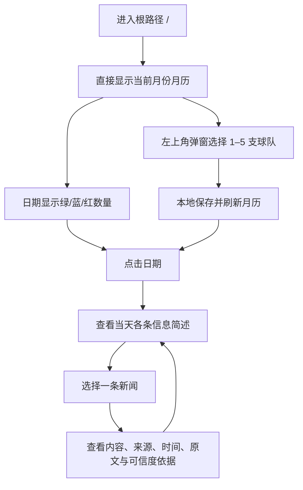

# 0126 Football V1 项目基线

> 版本：v1.1  
> 生效日期：2026-08-08  
> 当前阶段：Day 21–30 已完成并通过远端数据门禁，准备进入忠实中文处理阶段  
> 优先级：本文件是 V1 范围、用户流程和后续里程碑的当前基线；与旧文档冲突时以本文件和需求追踪矩阵为准。

## 1. 产品定义

0126 Football V1 是面向中国球迷的足球情报日历。用户打开网站后直接看到月历，可选择关注 1–5 支球队，查看每天绿色、蓝色、红色三类信息数量，再逐层进入当天简述和可追溯详情。

V1 的核心价值不是账号体系，也不是普通新闻首页，而是：

1. 打开即见日历，不用先注册或完成引导。
2. 一眼看到每个日期三种可信度级别的信息数量。
3. 点击日期即可浏览当天简述。
4. 点击新闻即可查看内容、来源、时间、原文和可信度依据。
5. 选择球队后只看相关内容，选择保存在当前浏览器。

## 2. V1 核心用户流程

## 3. V1 范围冻结

### 3.1 V1 必须具备

| 能力 | 验收标准 | 当前状态 |
|---|---|---|
| 日历作为首页 | `/` 首屏直接展示月历，不经过资讯首页或注册引导 | 已完成 |
| 球队选择 | 左上角弹窗展示 14 队，允许选择 1–5 队；0 队表示查看全部 | 已完成 |
| 本地保留 | 刷新或再次访问后保留球队选择 | 已完成 |
| 三色数量 | 每个日期同时展示绿色、蓝色、红色数量和文字说明 | 已完成 |
| 当天简述 | 点击日期后展示标题、球队、类型、标签、时间和短摘要 | 已完成 |
| 新闻详情 | 展示内容、来源名称、发布时间、事件时间、原文链接和可信度理由 | 已完成 |
| 数据降级 | Supabase 不可用时只显示明确标注的验收样例 | 已完成 |
| 响应式与无障碍 | 桌面和移动端可操作；颜色不是唯一信息载体 | 已完成 |

### 3.2 V1 后再做

- 登录、注册、找回密码、跨设备同步和游客关注合并。
- 独立的球队管理页、排序和账号设置。
- 信息类型、可信度和来源类型高级筛选器。
- 通知、每日摘要和用户偏好。
- 周视图、事件专题和个性化排序。

数据库中的 Auth、profile 和 follow 结构可以保留，但这些能力不作为当前 V1 页面或发布门禁。

### 3.3 必须依赖授权或数据门禁

- 任何真实 RSS、官网、API 或社交平台自动采集。
- 任何来源从“待授权/禁用”变为生产启用。
- 任何自动绿色判定、AI 翻译摘要或可信度评分。

没有明确权利状态时，只能使用模拟 Adapter、合成 Feed 和验收样例，不得把它们描述为真实新闻采集。

## 4. 页面信息架构

| 页面 | 路由 | V1 责任 | 状态 |
|---|---|---|---|
| 日历首页 | `/` | 月份、三色数量、球队弹窗、当天简述 | P0，已完成 |
| 日历兼容入口 | `/calendar` | 与首页保持相同核心能力 | P0，已完成 |
| 新闻详情 | `/news/[id]` | 内容、来源、时间、原文、可信度解释 | P0，已完成 |
| 登录注册 | `/auth` | V1 暂不开放，返回首页 | V1 后 |
| 旧选队页 | `/onboarding/teams` | V1 暂不开放，返回首页 | 已被弹窗替代 |
| 运营后台 | `/admin` | 来源审核、纠错、审计 | 后续里程碑 |

## 5. 数据与可信度边界

- 固定首批范围为 5 个联赛、14 支球队；任何扩充进入下一版本。
- 关注上限为 5 支；未选择表示“全部球队”，不是第 15 个关注项。
- 所有时间以 UTC 存储，界面按 Asia/Shanghai 展示。
- 绿色必须能追溯到已验证的直接官方来源；AI 不能单独把内容升级为绿色。
- 蓝色表示有明确来源但证据尚不足；红色必须有可读风险理由。
- V1 页面显示存储的标签和理由，不宣称自动可信度引擎已经完成。
- 只保存和展示必要元数据、短摘要与原文 URL，不全文转载受版权保护内容。

## 6. 已完成基线（Day 1–20）

| 阶段 | 已通过门禁 | 未包含能力 |
|---|---|---|
| Foundation | 产品范围、来源审核、可信度规则、多端架构 | 真实来源自动采集 |
| Data | 5 联赛、14 队、62 别名、来源身份、RLS、日历关系 | 本机 Day 16 pgTAP（缺 Docker） |
| Calendar V1 | 根路径月历、球队弹窗、三色计数、当天简述、详情 | 登录、高级筛选、自动标签 |
| Preview | Vercel 构建成功、页面 200、远端 Supabase 可读 | Production 发布 |
| Ingestion M4–M5 | 模拟采集闭环、权利门禁、幂等/重试、14 队来源复核、契约 Adapter、去重、匹配和健康状态 | 真实批准来源仍为 0 |

## 7. 后续里程碑（Day 21–45）

### M4：安全采集骨架（Day 21–25）

目标：使用模拟来源证明采集、日志、重试和幂等闭环，不等待真实来源授权。

| Day | 交付物 | Go 条件 |
|---:|---|---|
| 21 | `raw_items`、Adapter 接口、规范化输出、内容哈希 | 一个模拟 Feed 可写入 raw，并生成候选 news |
| 22 | `ingestion_runs`、任务锁、超时、重试、幂等键 | 同一批次重复执行不产生重复记录 |
| 23 | 来源启用门禁与权利状态检查 | 未批准来源无法被任务调用；测试覆盖拒绝路径 |
| 24 | 调度入口、结构化日志、失败隔离 | 单一 Adapter 失败不阻塞其他任务，错误可定位 |
| 25 | 模拟 Feed 端到端 Preview 回放 | raw → normalize → news → calendar 可复验，未冒充真实采集 |

### M5：批准来源与数据质量（Day 26–30）

目标：为 14 队建立合规可执行方案；真实接入数量以授权结果为准，不预先承诺 4 个 Feed。

| Day | 交付物 | Go 条件 |
|---:|---|---|
| 26 | 14 个官网与候选 RSS 技术/权利复核 | 每个来源归类为可接入、待授权、人工录入或禁用 |
| 27 | 第一个已批准来源 Adapter，或等价合成契约测试 | 来源字段、发布时间、原文链接正确 |
| 28 | URL 规范化、基础去重、删除/停用处理 | 重复链接合并，停用后不再调度 |
| 29 | 球队关键词与别名初筛 | 14 队基准样本可测，误关联有记录 |
| 30 | 来源健康与最近运行状态 | 每个启用来源可看到运行时间、数量和错误 |

### M6：忠实中文处理（Day 31–35）

目标：建立可重试、可评测的翻译摘要与实体匹配，不把个别示例当成验收。

| Day | 交付物 | Go 条件 |
|---:|---|---|
| 31 | AI 任务队列、结构化 Schema、模型版本和成本记录 | 失败重试不污染正式字段 |
| 32 | 语言识别、翻译、短摘要和数字/人名保护 | 50 条样本无关键事实虚构 |
| 33 | 球队/球员/赛事实体匹配 | precision ≥ 95%，recall ≥ 90% |
| 34 | 信息类型、声明主体和 `event_at` 提取 | 结构化结果可用于日历和未来高级筛选 |
| 35 | 100 条首轮评测集与错误台账 | 摘要事实忠实率 ≥ 95% |

### M7：聚类与可信度（Day 36–40）

目标：让标签可解释、可复核、可追踪，并在此阶段恢复高级筛选。

| Day | 交付物 | Go 条件 |
|---:|---|---|
| 36 | URL、标题、语义相似度去重与事件聚类 | 同一事件合并且不丢来源 |
| 37 | 引用链和独立来源识别 | 同源转载只计算一次证据 |
| 38 | 绿/蓝/红规则引擎 | 非官方内容不能被 AI 单独升级为绿色 |
| 39 | 判定解释、状态历史、类型/可信度高级筛选 | 标签理由和变化可追溯，筛选与 URL 可恢复 |
| 40 | 最小运营复核后台 | 人工操作受权限保护、可审计、可撤销 |

### M8：发布准备（Day 41–45）

目标：用真实证据决定是否发布 Production，不以日期自动放行。

| Day | 交付物 | Go 条件 |
|---:|---|---|
| 41 | 300 条人工标注评测 | 标签一致率 ≥ 85%，绿色 precision = 100% |
| 42 | RLS、密钥、输入、版权和删除流程安全检查 | 高危问题为 0 |
| 43 | 高数据量、移动端、无障碍、性能和恢复测试 | 阻塞级问题为 0，4G 首屏目标可接受 |
| 44 | 7 天 Preview 回放、数据库与 Vercel 回滚演练 | 运行手册、回滚证据和来源停用演练完成 |
| 45 | Go/No-Go 与 Production 发布 | 仅全部门禁通过时发布；否则明确延期 |

### V1 后：账号与个性化

登录注册不再占用 Day 21–45 主线。在日历、采集、来源和可信度闭环稳定后，单独安排账号里程碑：注册/登录、邮件确认、游客合并、跨设备同步、数据删除和隐私验收。

## 8. 每周项目核对

每个里程碑结束必须回答：

1. 是否仍固定 14 队、最多关注 5 队？
2. 是否引入了未经批准的真实来源？
3. 是否把模拟数据、手工标签或局部样例描述成自动生产能力？
4. 是否新增了 V1 范围外页面或账号功能？
5. 是否具备代码、测试、数据和 Preview 四类证据？
6. 是否存在未提交改动、失败测试或未记录的阻塞？

任何一项回答不清楚，里程碑状态保持“进行中”，不得标为完成。
